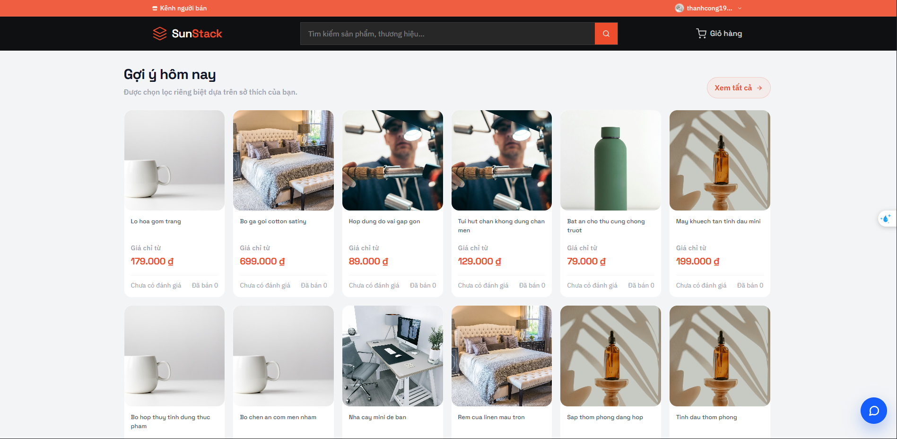
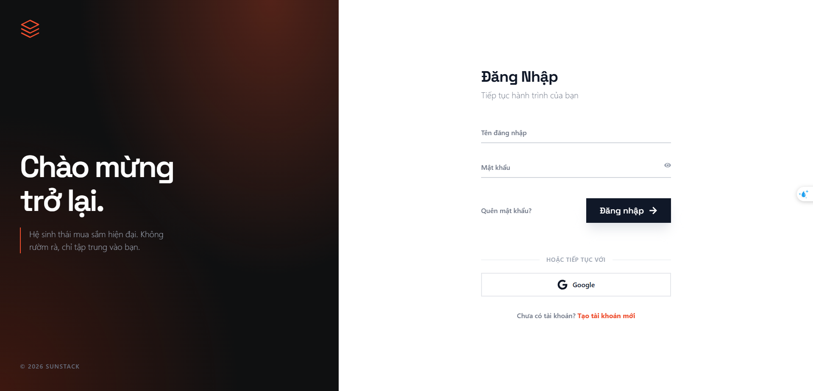
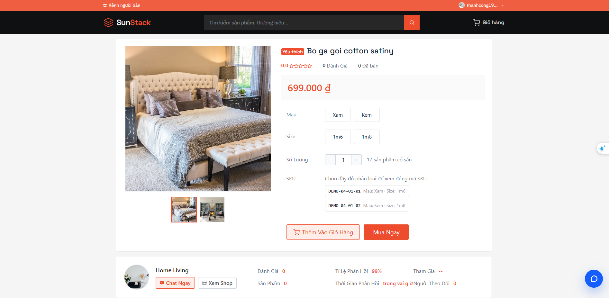
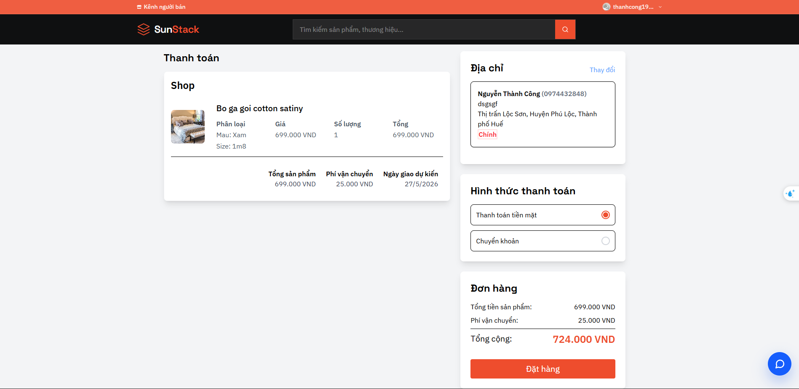
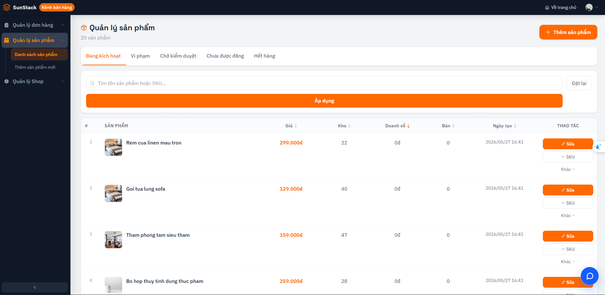
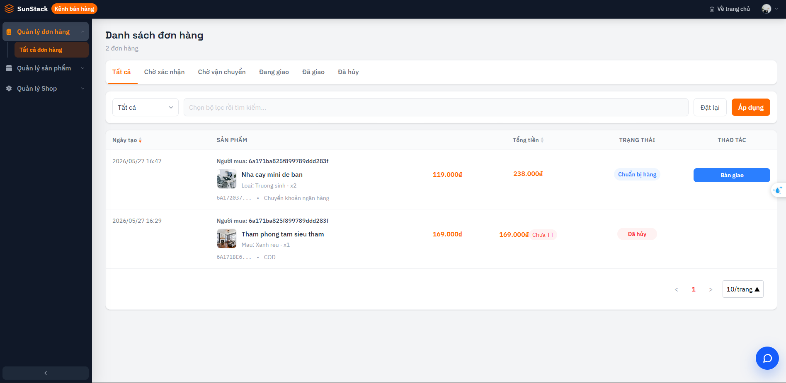

# CHTPT

## 📌 Giới thiệu

Đây là repository tổng hợp cho đồ án CHTPT, bao gồm ứng dụng thương mại điện tử SunStack và hệ thống thu gom, phân tích log tập trung bằng ELK Stack. SunStack là một website thương mại điện tử theo mô hình C2C (Customer-to-Customer), nơi mà một người dùng có thể là người mua hoặc người bán.

Mục tiêu của dự án là triển khai một hệ thống ứng dụng hoàn chỉnh, có khả năng chạy bằng Docker, hỗ trợ các thành phần backend, frontend, cơ sở dữ liệu, đồng thời tích hợp cơ chế giám sát log từ các node ứng dụng về một hệ thống ELK tập trung.
## 🏗️ Kiến trúc hệ thống

- **Kiến trúc hệ thống tại local**


    - Hệ thống SunStack được xây dựng theo kiến trúc microservices và triển khai bằng Docker.
    - Front-End sử dụng ReactJS, mọi request đều đi qua NGINX API Gateway để định tuyến và kiểm soát truy cập.
    - Back-End gồm nhiều microservice FastAPI hoạt động độc lập theo từng domain nghiệp vụ.
    - Các service giao tiếp qua HTTP nội bộ và Redis Streams theo mô hình event-driven.
    - MongoDB được sử dụng làm cơ sở dữ liệu chính, Redis phục vụ caching và message broker.
    - Hệ thống tích hợp Google Cloud Storage, OAuth2 Google và VNPay cho lưu trữ, xác thực và thanh toán.
    - ELK Stack (Filebeat, Logstash, Elasticsearch, Kibana) được dùng để thu thập, giám sát và trực quan hóa log hệ thống.
  

- **Kiến trúc hệ thống trên GCP** 

    - Hệ thống SunStack được triển khai trên Google Cloud Platform theo mô hình đa node sử dụng Google Compute Engine.
    - Cloud DNS và Cloud Load Balancing đảm nhận phân giải tên miền và cân bằng tải đến các node ứng dụng.
    - Node 1 và Node 2 chạy toàn bộ stack ứng dụng Docker gồm ReactJS, NGINX API Gateway và các FastAPI microservices.
    - Hai node ứng dụng hoạt động đối xứng, giúp hệ thống đảm bảo tính sẵn sàng cao và hỗ trợ scale ngang.
    - Node 3 là node dữ liệu chuyên biệt chạy MongoDB và Redis phục vụ lưu trữ, caching và Redis Streams.
    - Node 4 triển khai ELK Stack gồm Logstash, Elasticsearch và Kibana để thu thập, phân tích và trực quan hóa log.
    - Filebeat trên các node ứng dụng gửi log về Node 4; các log WARNING và ERROR được cảnh báo qua Discord Webhook theo thời gian thực.

## 🧩 Mô tả tổng quan

Dự án được chia thành hai phần chính:

- `code/sunstack`: mã nguồn ứng dụng SunStack, bao gồm backend, frontend, database, cấu hình Docker Compose, Filebeat agent và các tài liệu triển khai liên quan.
- `code/elk`: hệ thống ELK Stack tập trung, bao gồm Elasticsearch, Logstash, Kibana, cấu hình nhận log từ các node ứng dụng, cảnh báo Discord và tài liệu triển khai hạ tầng.

Trong đó, SunStack là phần ứng dụng chính cần được chạy trước để tạo ra service và log. Sau đó ELK được cấu hình để thu gom, xử lý, lưu trữ và hiển thị log từ SunStack.

## 📁 Cấu trúc dự án

```text
CHTPT/
├── README.md
├── code/
│   ├── sunstack/
│   │   ├── README.md
│   │   ├── backend/
│   │   ├── frontend/
│   │   ├── databases/
│   │   ├── elk/
│   │   ├── iac/
│   │   ├── logs/
│   │   ├── scripts/
│   │   └── ...
│   └── elk/
│       ├── README.md
│       ├── data/
│       ├── iac/
│       └── imgs/
├── excalidraw/
└── imgs/
```

### 🛒 `code/sunstack`

Thư mục này chứa toàn bộ mã nguồn và cấu hình của ứng dụng SunStack:

- `backend`: mã nguồn backend. Triển khai theo kiến trúc microservices.
- `frontend`: mã nguồn frontend.
- `databases`: cấu hình và dữ liệu liên quan đến các database.
- `elk`: cấu hình Filebeat hoặc thành phần phục vụ việc gửi log từ ứng dụng sang ELK.
- `iac`: mã hạ tầng phục vụ triển khai.
- `logs`: thư mục log của ứng dụng.
- `scripts`: các script hỗ trợ.

### `code/elk`

Thư mục này chứa cấu hình hệ thống log tập trung:

- Elasticsearch dùng để lưu trữ và tìm kiếm log.
- Logstash dùng để nhận, parse và phân loại log.
- Kibana dùng để trực quan hóa log và dashboard.
- Cấu hình cảnh báo Discord cho các log mức cảnh báo hoặc lỗi.
- Tài liệu triển khai local và triển khai trên GCP.

## ✅ Thứ tự thực hiện

Vui lòng thực hiện theo đúng thứ tự sau:

1. Đọc và làm theo hướng dẫn trong file `code/sunstack/README.md`.
2. Sau khi SunStack đã được cấu hình và chạy thành công, tiếp tục đọc và làm theo hướng dẫn trong file `code/elk/README.md`.

Không nên thực hiện phần ELK trước khi hoàn tất phần SunStack, vì ELK cần nhận log từ ứng dụng SunStack để có dữ liệu hiển thị và phân tích.

## 📚 Tài liệu hướng dẫn chi tiết

Các bước cài đặt, cấu hình môi trường, chạy Docker Compose, seed dữ liệu, thiết lập log, Kibana dashboard và triển khai hạ tầng đã được viết chi tiết trong hai file sau:

- `code/sunstack/README.md`: hướng dẫn chạy ứng dụng SunStack.
- `code/elk/README.md`: hướng dẫn chạy hệ thống ELK và kết nối log từ SunStack.

Hãy đọc và thực hiện theo đúng thứ tự: `code/sunstack/README.md` trước, sau đó đến `code/elk/README.md`.

## 🚀 Kết quả sản phẩm

Dưới đây là một số hình ảnh minh họa cho các chức năng và giao diện chính của hệ thống SunStack sau khi triển khai thành công:

### 1. Trang chủ (Home Page)
Giao diện chính của hệ thống hiển thị danh sách sản phẩm nổi bật, gợi ý hôm nay và các danh mục.


### 2. Trang Đăng nhập (Login Page)
Giao diện đăng nhập hỗ trợ xác thực bằng tài khoản hệ thống và OAuth2 Google.


### 3. Chi tiết Sản phẩm (Product Detail)
Trang hiển thị thông tin chi tiết của một sản phẩm, bao gồm giá, hình ảnh, mô tả, thông tin cửa hàng bán và tùy chọn thêm vào giỏ hàng.


### 4. Giỏ hàng và Thanh toán (Cart & Checkout)
Giao diện danh sách sản phẩm trong giỏ hàng và quy trình thanh toán (hỗ trợ tích hợp VNPay).


### 5. Kênh Người Bán (Seller Channel)
Giao diện cửa hàng (C2C) nơi người bán quản lý, đăng bán sản phẩm và xem các đơn hàng của mình.


### 6. Quản lý Đơn hàng (Order Management)
Giao diện theo dõi trạng thái đơn hàng và lịch sử mua hàng của người mua.

