# Hệ thống thu gom log tập trung cho nhiều node

## Kiến trúc tổng quan
 
Bao gồm 3 VM:

- **VM-ELK (central)**: chạy Elasticsearch + Logstash + Kibana
- **VM-APP-1** và **VM-APP-2**: chạy app sunstack + Filebeat đọc `./logs` và ship về central


```
                ┌──────────────────────────────────────────────┐
                │            Nguồn Log (Nodes)                 │
                │                                              │
                │  ┌─────────────────┐  ┌────────────────────┐ │
                │  │ Node SunStack 1 │  │   Node SunStack 2  │ │
                │  │  (ExternalIP1)  │  │   (ExternalIP2)    │ │
                │  │  Chứa Filebeat  │  │   Chứa Filebeat    │ │
                │  │ • service logs  │  │ • service logs     │ │
                │  │                 │  │                    │ │
                │  └────────┬────────┘  └────────┬───────────┘ │
                │           │                    │             │
                └───────────┼────────────────────┼─────────────┘
                            │                    │
                            └──────────┬─────────┘
                                       ▼
                            ┌─────────────────┐
                            │    Logstash     │  
                            │  Filter/Parse/  │  (port 5044)
                            │  Classify Logs  │
                            └────────┬────────┘
              ┌──────────────────────┴──────────────────────────┐
              ▼                                                 ▼
     ┌─────────────────┐                               ┌─────────────────┐
     │  Elasticsearch  │                               │    Discord      │
     │  (Central Logs) │                               │  Webhook Alert  │
     │                 │                               │  (ERROR/WARN)   │
     └────────┬────────┘                               └─────────────────┘
              ▼
     ┌─────────────────┐
     │     Kibana      │  
     │  Dashboards &   │   (port 5601)
     │  Visualizations │
     └─────────────────┘
```

- `5044/tcp` (Logstash beats input) — **APP VMs** sẽ connect vào đây
- `9200/tcp` (Elasticsearch) — truy cập nội bộ hoặc cho Kibana
- `5601/tcp` (Kibana UI)

## Hướng dẫn setup và chạy
### Yêu cầu về môi trường
- Có Docker (Docker Compose v2)
- Khuyến nghị: RAM ≥ 4GB cho Elasticsearch/Kibana

### Các bước chi tiết
#### Chạy ELK ở local

Đổi tên file `.env.example` thành `.env`.

Tạo **channel Discord** và lấy **webhook Discord**, sau đó điền vào file `.env` (có thể xem hướng dẫn tại đây: [Hướng dẫn lấy webhook Discord](https://www.youtube.com/watch?v=OtegFbcnBCk)).

Vào thư mục `elk` và chạy:
```bash
docker compose --env-file .env -f docker-compose-elk.yml up -d
```

Sau khi chạy xong thực hiện

```bash
docker exec -ti elk-kibana sh
```

```sh
curl -X POST -u "elastic:myelasticpass" \
  -H "Content-Type: application/json" \
  http://elastic:9200/_security/user/kibana_system/_password \
  -d '{ "password": "kibanapass" }'
```

Sau khi sunstack app chạy thành công, **Filebeat** sẽ lấy log từ thư mục `./logs` và gửi về **Logstash**. **Logstash** đẩy log vào **Elasticsearch**.

Truy cập Kibana: `localhost:5601`
- user: `elastic`
- pass: `myelasticpass`

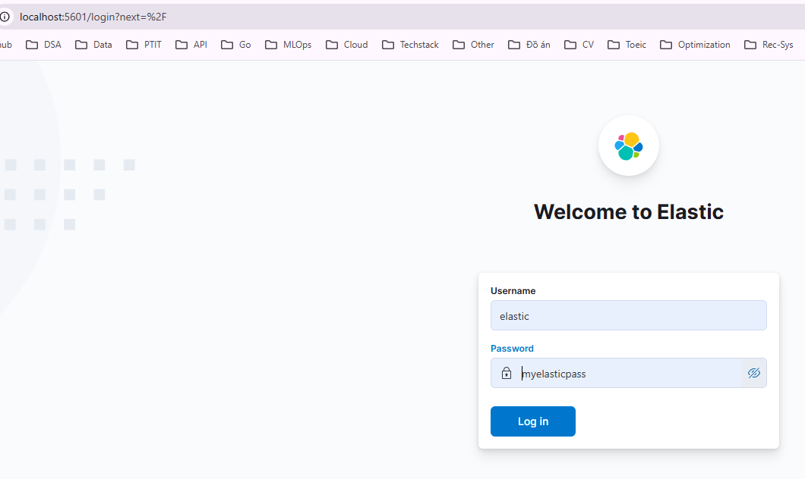

Bấm vào dấu 3 gạch ngang sau đó lướt xuống ở phần `Management` chọn `Stack Management`

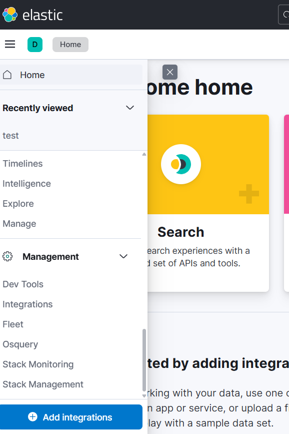

Lướt xuống `Kibana` chọn `Data Views` -> `Create data view` 
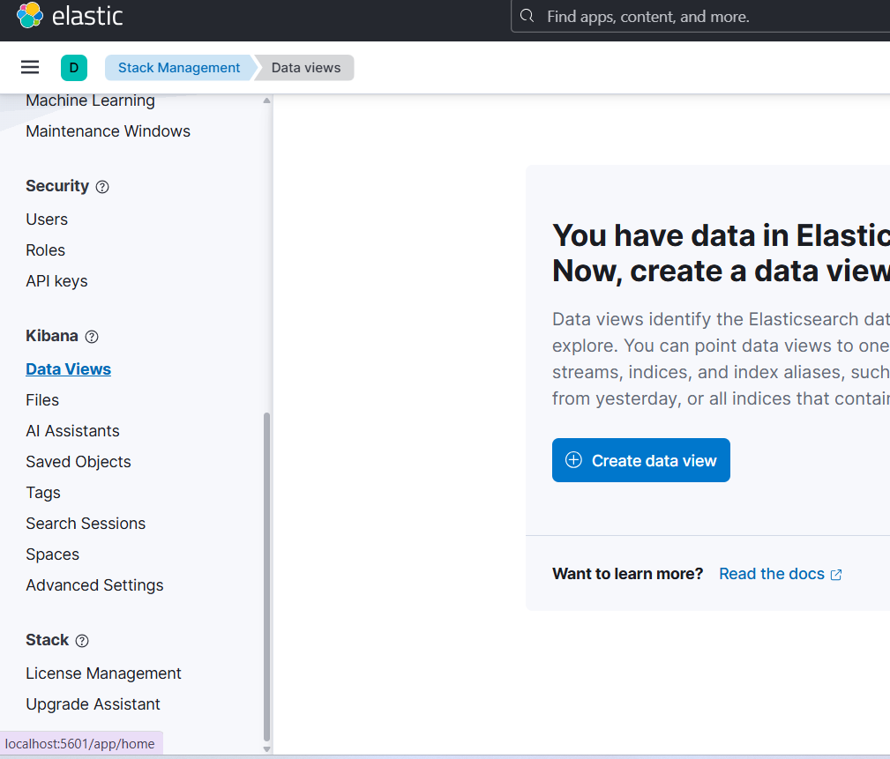

Điền field Name tùy thích nhưng phần `Index pattern` để là `btl-*`

Sau đó `Save data view to Kibana`

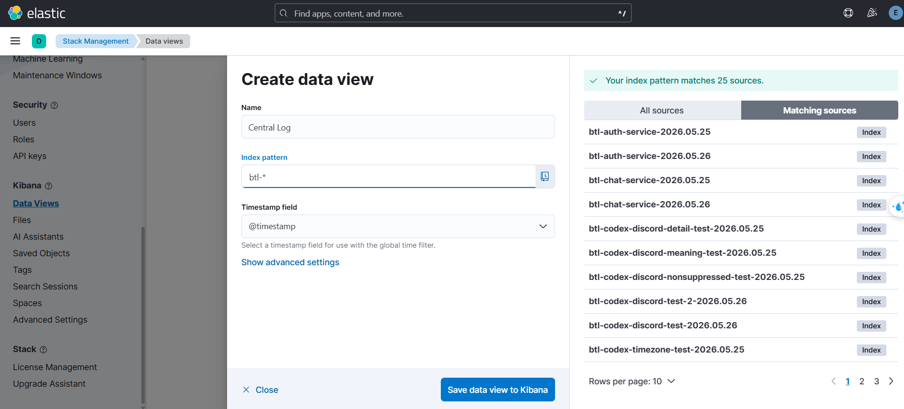

Bấm lại phần 3 gạch và chọn `Discover`

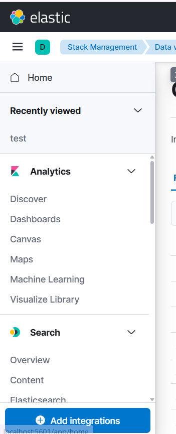

Ở giao diện này có thể theo dõi được log từ các service đổ về, có thể chọn thêm field để xem và query theo nhiều field.

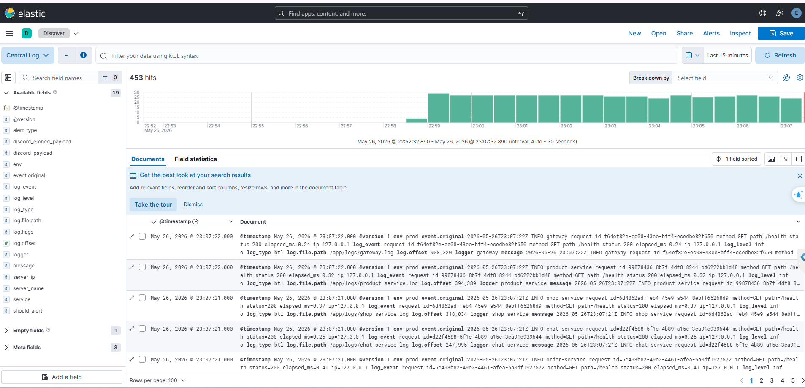

Sau khi thêm 3 field `message`, `service`, `log_level`

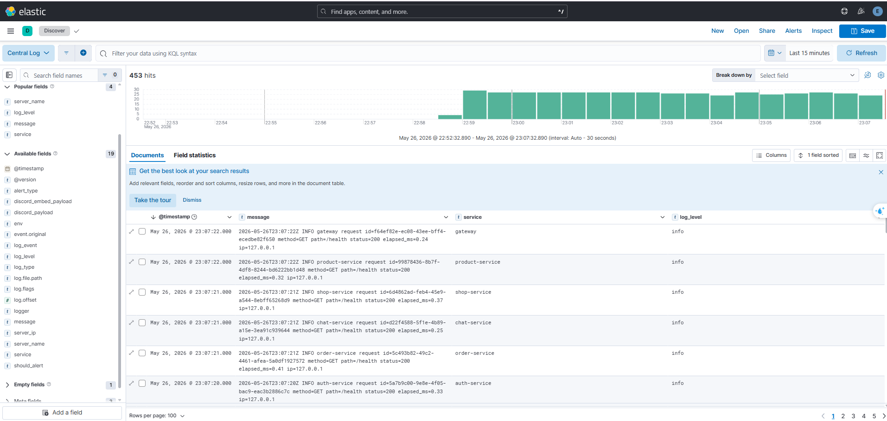

Có thể query theo `log_level` bằng cách nhập vào ô search: `log_level : info`

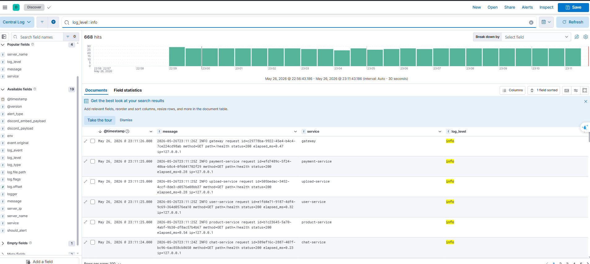


Ngoài ra, Kibana cũng có giao diện dashboard để theo dõi 1 số metric của service. Việc xây dựng dashboard có thể xem trong file [kibana-service-dashboard.md](./kibana-service-dashboard.md)

Thực hiện import file [export.ndjson](./export.ndjson) để nhận được dashboard như sau:

Chọn tab `Management` -> `Stack Management` -> `Kibana` -> `Saved Objects`

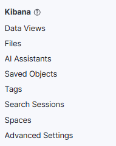

Chọn `Import`

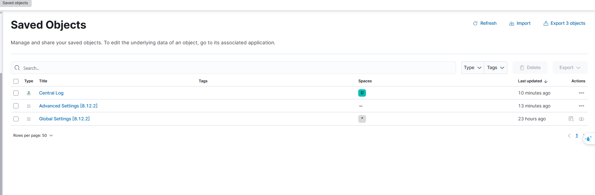

Chọn file `export.ndjson`

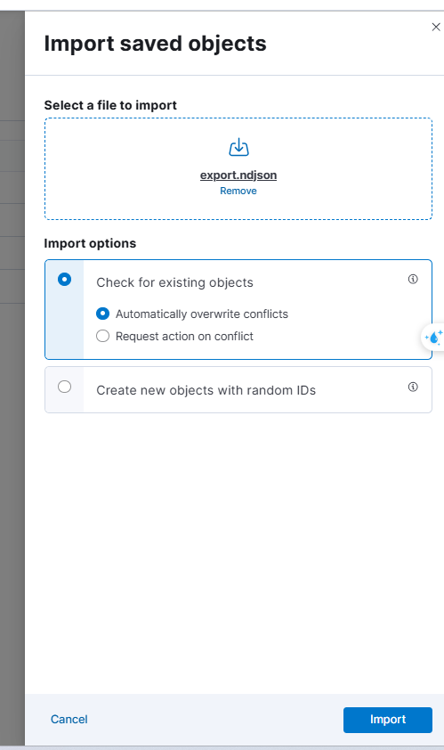

Nhấn `Import` -> `Done` rồi quay lại tab `Analytics` -> `Dashboards` thì sẽ thấy xuất hiện Dashboard, bấm vào đó.

Tại đây sẽ thấy được các dashboard được xây sẵn 

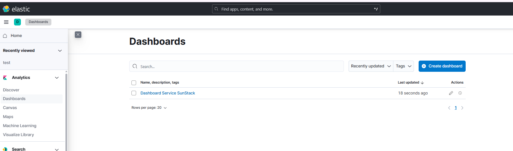

Hiện tại có 3 chart bao gồm:
- Số bản ghi log của từng service mỗi 30s
- Số bản ghi log level info và error mỗi 30s
- Biểu đồ tròn thành phần các level log

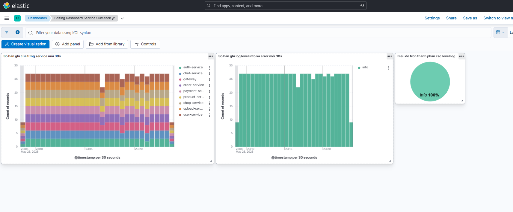

### Triển khai ELK trên GCP (Compute Engine)

Xem thư mục `elk/iac/ansible` và có hướng dẫn triển khai trong file `README.md`


## 2) App VM: chạy Filebeat agent để ship log file `./logs`

### File liên quan
- `BTL/docker-compose.yml` (dev)
- `BTL/docker-compose-prod.yml` (prod)
- `BTL/elk/filebeat-app-vm.yml`

### Yêu cầu
- App của bạn phải ghi log ra thư mục `./logs` (project đã mount `./logs:/app/logs`)
- Central VM mở port `5044`

### Biến môi trường (trên từng APP VM)
Tạo `.env` hoặc export env:

```env
# Identify VM
HOSTNAME=app-vm-1
HOST_IP=<ip-app-vm-1>
ENVIRONMENT=prod
LOG_TYPE=btl

# Central Logstash
LOGSTASH_HOST=<ELK_VM_IP>:5044
```

### Chạy

```bash
# 1) chạy app stack (đã bao gồm filebeat) như bình thường
# dev:
# docker compose -f BTL/docker-compose.yml up -d
# prod:
# docker compose -f BTL/docker-compose-prod.yml up -d
```

## 3) Kibana: tạo Data View
Trong Kibana:
- Stack Management → Data Views → Create data view
- Pattern: `btl-*`
- Time field: `@timestamp`

Index naming hiện tại (Logstash):
- `btl-<service>-YYYY.MM.dd`

Trong đó `<service>` được suy ra từ đường dẫn file `/logs/<service>/...`.

## 4) Discord alerts
- Logstash sẽ gửi alert khi `log_level` là `error/critical/warning/warn`
- Throttle theo cặp `(service, alert_type)` với `ALERT_THROTTLE_SECONDS` (mặc định 60s)

## Troubleshooting nhanh
- Filebeat không gửi được: xem log container `filebeat`
- Logstash không nhận: xem log container `elk-logstash` và đảm bảo port 5044 mở
- Không thấy index: kiểm tra Elasticsearch `http://localhost:9200/_cat/indices?v`

Stack Management -> Index Managemen -> 