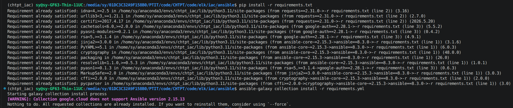
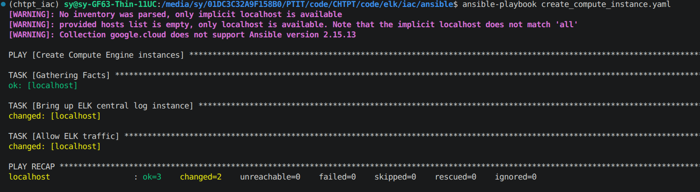
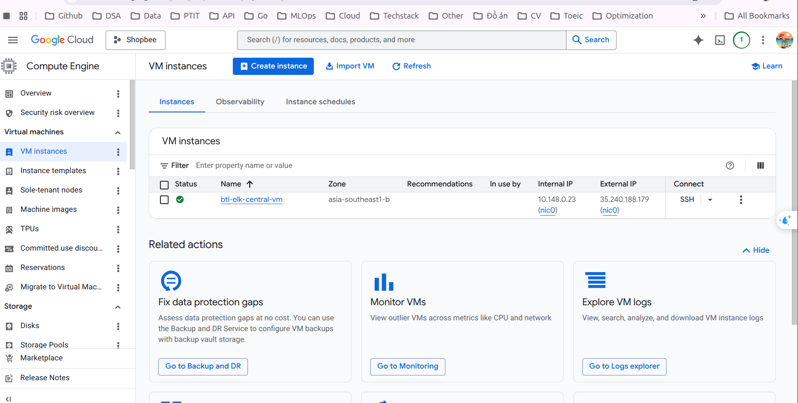
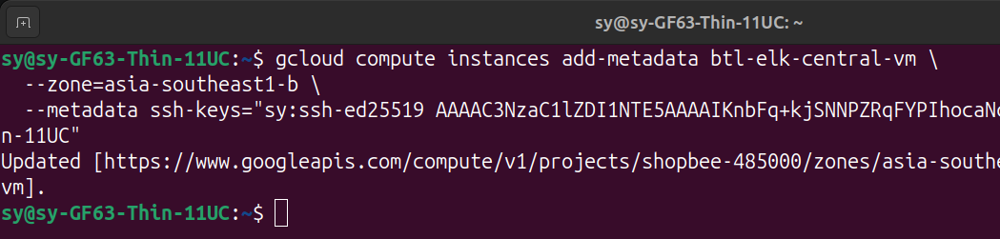
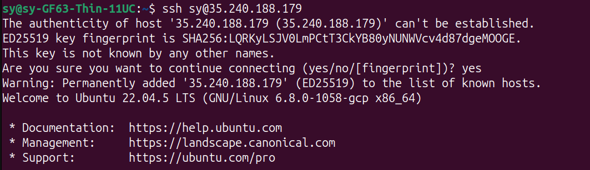
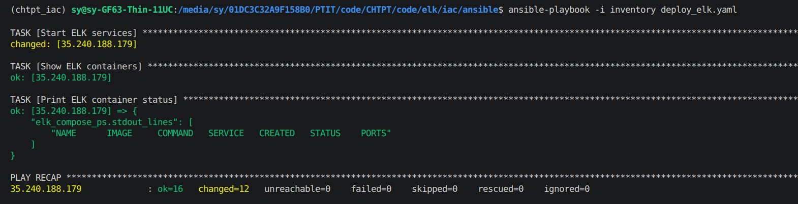
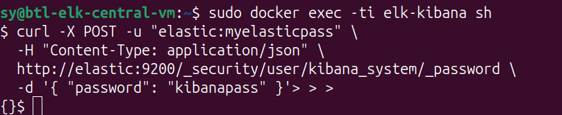
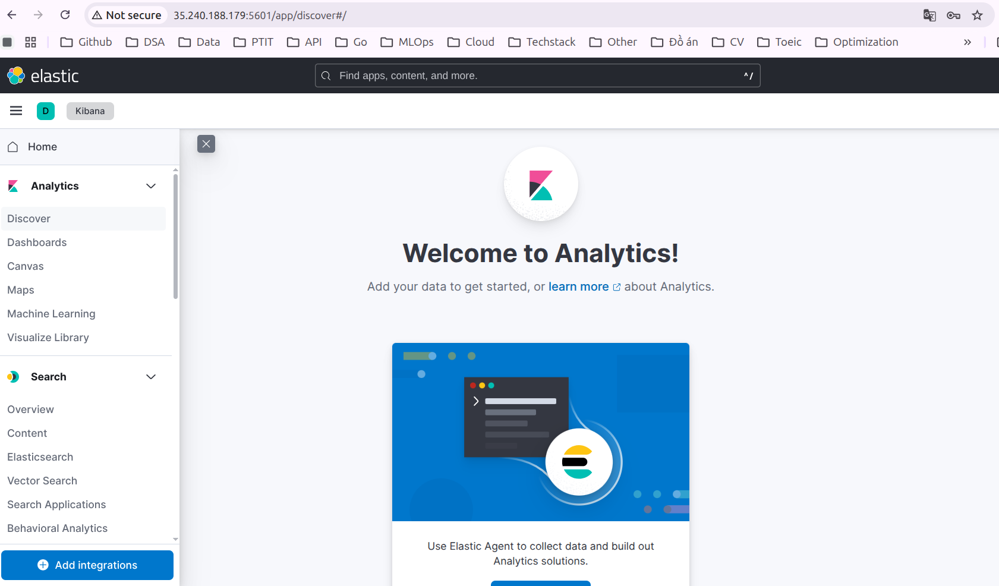

# Triển khai ELK Central Log trên GCP bằng Ansible

Thư mục này dùng để **khởi tạo và triển khai VM ELK Central**.

## Hướng dẫn setup và chạy

### Yêu cầu về môi trường

- Sử dụng Ubuntu hoặc WSL trên Window 

- Cần có tài khoản Google Cloud và thiết lập Service Accounts với các role như `Compute Admin, Storage Admin` (Có thể xem ở [tạo service account](https://docs.cloud.google.com/iam/docs/service-accounts-create#iam-service-accounts-create-console))

- Lấy secret key cho ansible theo hướng dẫn: 
  - Ansible cần Service Account để đọc dữ liệu trên GCP.
  - Chuyển đến mục IAM & Admin > Service Accounts.
  - Nhấn vào tài khoản service account đã tạo bên trên và chọn Keys > Add Key > JSON để tải xuống file khóa bí mật dạng JSON (chứa thông tin xác thực).

- Thay file đó cho file `shopbee-485000-8459e98cfb12.json`

### Các bước chi tiết

#### 1) Cài đặt dependency trên máy local

Trong thư mục `iac/ansible`:

```bash
pip install -r requirements.txt
ansible-galaxy collection install -r requirements.yml
```



#### 2) Thay đổi các biến liên quan đến secret key

Thay các biến projectid và tên file secret trong file [create_compute_instance.yaml](./create_compute_instance.yaml) và nhớ để state là `present` (chuyển qua `absent` nếu muốn xóa tài nguyên).


#### 3) Tạo VM ELK Central trên GCP

Playbook sẽ tạo một VM có tên mặc định: `btl-elk-central-vm`.

```bash
ansible-playbook create_compute_instance.yaml
```




Sau khi VM được tạo:
1. Lấy **External IP** của VM
2. Điền IP này vào file `inventory` để Ansible có thể SSH và deploy.

Ghi chú: nếu VM chưa có SSH key/không SSH được, có thể add metadata SSH key như ví dụ dưới đây (sửa lại tên VM, zone và key cho đúng môi trường của):

```bash
gcloud compute instances add-metadata btl-elk-central-vm \
  --zone=asia-southeast1-b \
  --metadata ssh-keys="<user>:ssh-ed25519 <YOUR_PUBLIC_KEY>"
```



```bash
ssh <user>:<external_ip>
```




## 4) Deploy ELK lên VM

```shell
ansible-playbook -i inventory deploy_elk.yaml
```



## 5) Cấu trúc thư mục sau khi chạy 

Trên VM ELK Central, các file chính sẽ nằm ở:

```text
/opt/elk
  docker-compose-elk.yml
  logstash.conf
  data/
```

> Thực hiện tiếp 

Trên VM sau khi ssh:

```bash
sudo docker exec -ti elk-kibana sh
```

```sh
curl -X POST -u "elastic:myelasticpass" \
  -H "Content-Type: application/json" \
  http://elastic:9200/_security/user/kibana_system/_password \
  -d '{ "password": "kibanapass" }'
```



Giờ có thể truy cập Kibana thông qua `ExternalIP:5601`



> Các bước tiếp theo thực hiện như trong file `README.md` trong thư mục `/elk`.