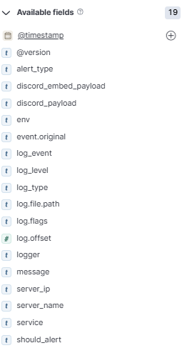

# Hướng dẫn tạo dashboard giám sát service với Kibana

Tài liệu này dùng khi log của service đã được đẩy về Elasticsearch và muốn tạo dashboard trên Kibana để giám sát tình trạng service: lỗi, traffic và hiệu năng.

## 1. Tạo Data View

Vào Kibana:

```text
Stack Management -> Data Views -> Create data view
```
Tạo Data View với pattern:

```text
btl-*
```

Chọn time field:

```text
@timestamp
```

Sau khi tạo xong, vào:

```text
Analytics -> Discover
```

Kiểm tra log đã hiển thị đúng chưa, mốc thời gian có đúng không, và các field quan trọng đã được parse ra chưa.

## 2. Các field có trong log




## 3. Tạo dashboard

Vào Kibana:

```text
Analytics -> Dashboard -> Create dashboard
```

Sau đó thêm các panel bên dưới.

## 4. Các panel 

### 4.1. Log count theo thời gian

Dùng để theo dõi service có đang phát log bình thường hay có đột biến bất thường.

Loại visualization:

```text
Lens
```

Cấu hình:

```text
X-axis: @timestamp
Y-axis: Count
Breakdown: service.name hoặc log.level
```

### 4.2. Error count

Dùng để theo dõi số lượng log lỗi theo thời gian.

KQL filter:

```kql
log.level: "ERROR" or log.level: "error"
```
Cấu hình:

```text
X-axis: @timestamp
Y-axis: Count
Breakdown: service.name
```

### 4.3. Log level breakdown

Dùng để xem tỷ lệ INFO, WARN, ERROR.

Cấu hình:

```text
Chart: Pie chart hoặc Stacked bar
Field: log.level
Metric: Count
```

Sau đó add saved search này vào dashboard.

> Trên đây là những Panel đã được triển khai trong Dashboard. Do giới hạn về mặt thời gian nên chưa triển khai được thêm các phần sau:

### Bố cục dashboard gợi ý

Nên chia dashboard thành 4 nhóm.

#### Overview

```text
Total logs
Error count
Error rate
Active services
```

#### Traffic

```text
Logs over time
Requests by service
HTTP status distribution
Top endpoints
```

#### Reliability

```text
5xx over time
Top failing endpoints
Recent errors
Error logs by service
```

#### Performance

```text
Average latency
P95 latency
P99 latency
Slowest endpoints
```

## 5. Export/Download dashboard

Có thể export dashboard ra file `.ndjson` để lưu trữ hoặc import sang môi trường khác.

Đường dẫn export:

```text
Menu góc trái ☰
Management -> Stack Management
Saved Objects
```

Sau đó:

```text
Tìm dashboard 
Tick chọn
Bấm Export
```

Kibana sẽ tải về file `.ndjson`.
